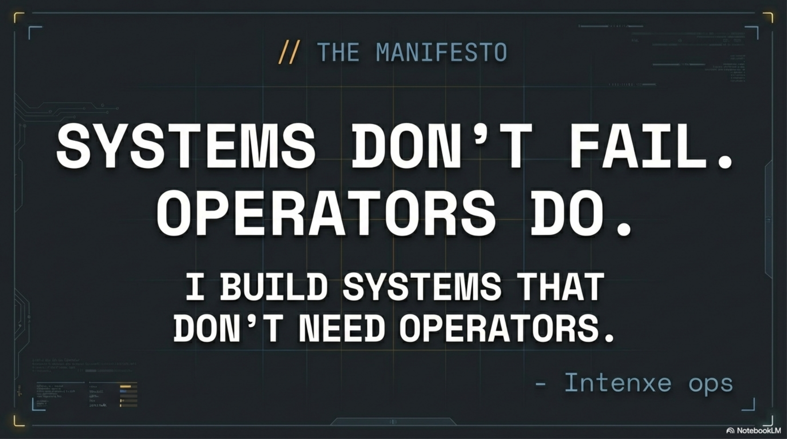
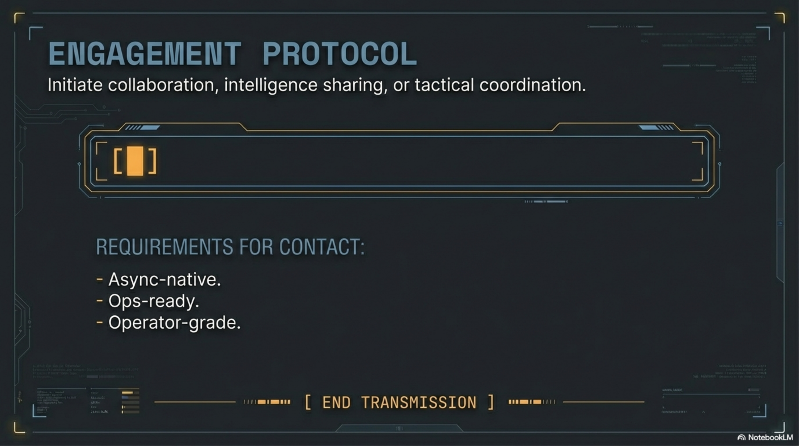

<!-- GHOST PROTOCOL — BEHAVIORAL AUTOMATION ARCHITECT -->

---

## 🎯 MISSION PROFILE

**ROLE:** Psy Systems Architect  
**CLEARANCE:** Maximum  
**SPECIALTY:** Behavioral Ops

> *"I'm not a full-stack dev. I'm a psy systems architect who uses code like a blade."*

**OPERATIONAL PARAMETERS:**
- No corporate speak. No fluff. No pitches.
- Ops-only: Every system built for field deployment.
- Precision-focused: Tools serve the mission, not the resume.

---

## ⚙️ SYSTEM ARCHITECTURE

### Integrated Weaponized Workflow

Layers do not function in isolation. A singular operational unit.

**THE VIEW** — Frontend Warfare  
**THE BRAIN** — Behavioral Systems  
**THE MUSCLE** — Backend/AI Ops

---

## 🎨 LAYER 1 // FRONTEND WARFARE

**Sniper-tier UIs & Zero Templates.**

### TECH SPECIFICATIONS:
- ⚙️ Next.js + React (Handwired components)
- ⚡ Vite (Lethal build speed)

### OPERATIONAL CAPABILITIES:
- Custom UX macros
- Region triggers
- Coordinate-based automation

> *Vision into ops. Every pixel serves the mission.*

---

## 🧠 LAYER 2 // BEHAVIORAL SYSTEMS

**Neuropsychology-Driven Decision Intelligence.**

### CORE PHILOSOPHY:
*"I don't react — I detect."*

### CAPABILITIES:
- 👁️ Psychological trigger detection
- 🎯 Intent recognition engines
- 🔗 Neuropsych-driven logic

> *Neuro-tactical analysis. Every decision is calculated.*

---

## 🤖 LAYER 3 // AI AGENT ORCHESTRATION

**Multi-Model Intelligence Systems.**

### THE STACK:
- ⚙️ Claude + GPT-4o relay coordination
- ⚡ Webhook-based logic chains
- 🔗 WORM agents (Write Once, Read Many)
- 🔄 Feedback loops

⚠️ **Agents built like soldiers, not assistants.**

> *Multi-agent command structure. Every mission is coordinated.*

---

## 💪 LAYER 4 // BACKEND OPS

**The Infrastructure of Execution.**

### TECH STACK:
- ⚙️ Make (Visual logic orchestration)
- 🗄️ Supabase (Async DB coordination)
- 🐍 Node.js + Python (Execution layers)
- 🔗 Native webhook choreography

> *Event-driven architecture — events as weapons.*

---

## 🌐 SPECIAL OPS // WEB3 + DAO INTELLIGENCE

**Cross-Chain Behavior Ops.**

### THE ARMORY:
- 🔷 Solidity smart contracts
- 📦 Ethers.js / Wagmi / Web3.js

### TACTICAL APPLICATIONS:
- Governance UI systems & Proposal engines
- Grant sniping & Incentive alignment
- Wallet integrations

> *DATA STREAM: DAO_OPS // CROSS-CHAIN_EXECUTION // SYSTEM STATUS: ACTIVE // TARGET: MULTI-CHAIN GOVERNANCE*

---

## 🎯 INTELLIGENCE LAYER // SENSOR SUITE

**INPUT → PROCESSING → OUTPUT**

- **INPUT:** Tesseract OCR • Telegram Bots
- **PROCESSING:** Neural Networks • Behavioral Analytics • OpenAI Agents
- **OUTPUT:** Real-time Pattern Recognition • Psychological Profiling

> *DATA FLOW: SENSOR_INTEGRATION // SYSTEM STATUS: ACTIVE // TARGET: THREAT_DETECTION*

---

## 🌍 CAPABILITIES // ASYNC-NATIVE OPERATIONS

### CORE MECHANICS:
- 🌐 Multi-agent coordination across time zones
- 🔗 Webhook choreography for distributed systems
- 📡 Event-driven intelligence gathering

**RESULT:** Zero-latency decision pipelines.

> *DATA STREAM: GLOBAL_ASYNC_OPS // SYSTEM STATUS: ACTIVE // TARGET: DISTRIBUTED_SYSTEMS_OPTIMIZATION*

---

## 🎭 CAPABILITIES // PSYCHOLOGICAL WARFARE

### TACTICS:
- Behavioral trigger systems
- Intent detection frameworks
- User psychology integration

### OBJECTIVE:
Conversion optimization through cognitive patterns.

> *DATA STREAM: PSY_OPS // SYSTEM STATUS: ACTIVE // TARGET: COGNITIVE_CONVERSION // USER_ENGAGEMENT_ANALYSIS*

---

## 🚀 TACTICAL APPROACH // RAPID DEPLOYMENT

### PROTOCOL:
- ▶️ Prototype while learning.
- ▶️ Stack absorption in real-time.
- ▶️ Mission-focused execution.

> *Tools are parts of the war rig.*

---

## 📜 THE MANIFESTO

# **SYSTEMS DON'T FAIL. OPERATORS DO.**

**I BUILD SYSTEMS THAT DON'T NEED OPERATORS.**

*— Intenxe ops*

---

## 📡 ENGAGEMENT PROTOCOL

**Initiate collaboration, intelligence sharing, or tactical coordination.**

### REQUIREMENTS FOR CONTACT:
- Async-native.
- Ops-ready.
- Operator-grade.

**[ ⚡ ]**

### 🔴 ACTIVE DEPLOYMENTS

**TECH STACK:** `TypeScript` · `Python` · `Solana` · `Claude API` · `Next.js` · `Supabase` · `Solidity`

---

**[ END TRANSMISSION ]**

